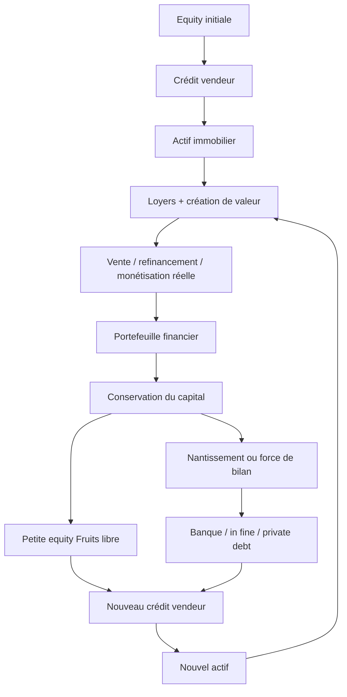

# Vente à terme / crédit vendeur — système Fruits

> **Statut :** cadre de décision et hypothèses à tester, pas décision d’exécution.
>
> **Validation obligatoire :** notaire, avocat bancaire/fiscaliste, expert-comptable, banque et vendeur sur chaque opération.
> **Source principale du produit :** cette note remplace les descriptions économiques dispersées. Le pack de prospection reste dans [Pack Crédit vendeur](../02_Investisseurs/16_Pack_Credit_Vendeur.md).
> **Source canonique des placements :** [Univers d’investissement et allocation de capital Fruits](../01_Strategie/07_Univers_Investissement_Fruits.md). Cette note conserve les stress propres à Zero/Step/Balloon sans dupliquer le catalogue.

## 0. La distinction impossible à manquer

> Le vendeur ne donne pas 400 000 € de cash à Fruits.
>
> Il accepte simplement que Fruits lui paie ces 400 000 € plus tard.

Cas standard de toute la note :

```text
Valeur du bien : 500 000 €
Bouquet Fruits : 100 000 €
Solde vendeur : 400 000 €
Taux vendeur indicatif : 1,5 %
Durée de référence : 10 ans
Frais d'acquisition indicatifs : 40 000 €
```

À la signature, hors frais :

```text
Actif Fruits : 500 000 €
Dette vendeur : 400 000 €
Equity initiale Fruits hors frais : 100 000 €
```

Le cash réellement mobilisé par Fruits est au moins :

```text
bouquet 100 000
+ frais d'acquisition 40 000
+ travaux
+ réserves initiales
- financements externes effectivement obtenus
```

Dans l’exemple sans autre financement, le besoin initial est donc **140 000 € avant travaux et réserves**, et non 100 000 €.

Les 400 000 € deviennent du cash dans le bilan uniquement :

1. lors d’une revente payée par un nouvel acheteur ;
2. lors d’un refinancement effectivement accordé ;
3. par un apport de capitaux externes ;
4. progressivement, via les cash-flows du bien.

Même après revente, 400 000 € de dette encore due ne deviennent pas 400 000 € de cash libre : la sûreté de remplacement, le remboursement final et les covenants continuent de grever ce capital.

## 1. Synthèse des trois produits

| Produit | Vendeur adapté | Bouquet de travail | Durée à tester | Paiement de référence | Garantie de départ | Utilité Fruits | Risque dominant | Sortie préférée |
| --- | --- | ---: | ---: | --- | --- | --- | --- | --- |
| **Fruits Balloon** | recherche revenu régulier et désendettement progressif | 20–40 % selon besoin vendeur | 5–15 ans | 1 500 €/mois puis ballon | hypothèque vendeur / rang négocié | compromis cash-flow / risque final | mensualité et ballon résiduel | hold ou vente |
| **Fruits Zero** | accepte intérêts seuls et sécurité forte | à négocier | 7–15 ans | 500 €/mois puis 400 k€ | sûreté forte + plan de remboursement | liquidité courante maximale | mur de 400 k€ | vente certaine ou liability matching |
| **Fruits Step** | accepte une montée progressive des paiements | 20–40 % selon besoin vendeur | 7–15 ans | 500 €, puis 1 000 €, puis 2 000 €/mois | hypothèque vendeur / rang négocié | garde du cash tôt, réduit ensuite la dette | DSCR tardif + ballon | hold stabilisé ou vente |

Ces bouquets et durées sont des **variables de négociation**, pas des conditions de marché validées. Le cas 100/400 représente une dette vendeur de 80 % de la valeur : c’est beaucoup plus agressif que l’ancien pack Fruits limité à 5–30 % du prix.

### Décision provisoire

| Mécanisme | Statut Fruits | Motif |
| --- | --- | --- |
| Balloon | **GO SOUS CONDITIONS** | le plus lisible pour un vendeur prudent si le DSCR et le ballon sont couverts |
| Step | **GO SOUS CONDITIONS** | candidat généraliste, mais seulement si les paiements tardifs passent le stress |
| Zero | **EXPERIMENTAL** | performant en cash-flow courant, dangereux à maturité |
| Revente avec dette remboursée | **GO SOUS CONDITIONS** | sortie classique si marge nette réelle |
| Revente avec dette maintenue | **EXPERIMENTAL** | exige accord vendeur, nouvelle sûreté et couverture suffisante |

## 2. Pourquoi un vendeur accepterait

Fruits ne doit jamais vendre le crédit vendeur comme un sacrifice unilatéral. L’offre doit échanger une préférence du vendeur contre une flexibilité utile à Fruits.

Le vendeur peut valoriser :

- un prix nominal mieux défendu ;
- un bouquet immédiat adapté à son besoin ;
- un revenu contractuel ;
- une fréquence de paiement choisie ;
- une garantie réelle ;
- une créance transmissible ;
- un calendrier patrimonial ;
- une vente facilitée sur un actif peu liquide.

Il peut refuser parce qu’il :

- a besoin de tout le cash ;
- doit solder une dette supérieure au bouquet ;
- ne veut pas porter le risque Fruits ;
- juge le taux insuffisant face à l’inflation, la fiscalité et le risque ;
- refuse la durée, le ballon ou une substitution de sûreté ;
- préfère replacer immédiatement le prix.

### Trois offres vendeur simples

| Offre | Proposition | Produit naturel |
| --- | --- | --- |
| **Sécurité** | bouquet plus élevé, amortissement plus fort, sûreté prioritaire | Balloon |
| **Revenu** | bouquet moyen, paiements réguliers, taux ajusté au risque | Balloon ou Step |
| **Prix / patrimoine** | prix nominal potentiellement supérieur contre paiement plus différé | Step ou Zero, après validation fiscale |

Ne jamais affirmer qu’une résidence principale, l’IFI, l’âge, une succession ou une indivision créent automatiquement un avantage. Ce sont des contextes à analyser avec le vendeur et ses conseils.

## 3. Les quatre moteurs de création de valeur

Le différé de paiement ne crée pas de richesse. Il crée du temps et du levier.

### A — Exploitation du bien

Deux scénarios à tester :

```text
NOI / revenu net avant dette vendeur : 2 000 €/mois = 24 000 €/an
NOI / revenu net avant dette vendeur : 2 500 €/mois = 30 000 €/an
```

Le NOI doit être calculé après vacance normalisée, charges non récupérables, taxe foncière, assurance, gestion, maintenance et CAPEX récurrent, mais avant dette et impôt.

### B — Dette vendeur au coût complet compétitif

```text
400 000 € × 1,5 % = 6 000 €/an
```

Le taux facial ne suffit pas :

```text
coût vendeur complet =
intérêts
+ surprix payé pour obtenir le différé
+ frais de sûreté / mainlevée
+ assurance / garantie
+ bonus ou partage d'upside
+ frais juridiques et de gestion
+ coût des réserves immobilisées
```

Comparer l’IRR des flux emprunteur entre banque amortissable, banque in fine, dette privée et crédit vendeur. Une dette vendeur à 1,5 % assortie d’un surprix de 30 k€ n’est pas une dette à 1,5 % économiquement.

### C — Capital conservé réellement productif

```text
rendement net du capital conservé
> coût complet net du crédit vendeur
+ marge de sécurité pour volatilité et illiquidité
```

Illustrations, non promesses :

```text
vendeur : 1,5 %
placement net : 4,0 %
spread brut avant coûts et risque : +2,5 points

vendeur : 1,5 %
capital dormant : 0 %
spread : -1,5 point
```

### D — Création de valeur immobilière

```text
achat : 500 k€
valeur stabilisée testée : 525 k€ / 550 k€ / 600 k€
```

Sources défendables :

- travaux et amélioration du DPE ;
- baisse de vacance et des impayés ;
- loyers optimisés légalement ;
- meilleur mix locatif ;
- division ou changement d’usage autorisé ;
- services rentables ;
- qualité des baux et de l’exploitation.

La hausse générale du marché reste un upside, jamais le cas de base.

### Équation Fruits

```text
valeur créée =
NOI net
+ valeur immobilière réalisée
+ rendement net du capital libre
- coût complet des dettes
- frais et fiscalité
- pertes et coût du risque
```

## 4. Mécanique chiffrée des produits

Hypothèses communes :

```text
principal : 400 000 €
taux nominal : 1,5 %
taux mensuel : 1,5 % / 12
durée : 120 mois
paiements en fin de mois
```

Les mensualités ci-dessous incluent intérêts et, lorsqu’elles les dépassent, amortissement du principal.

| Produit | Calendrier | Paiements courants cumulés | Ballon final | Intérêts totaux | DSCR à 24 k€ de NOI | DSCR à 30 k€ de NOI |
| --- | --- | ---: | ---: | ---: | ---: | ---: |
| Zero | 500 €/mois | 60 000 € | 400 000 € | 60 000 € | 4,00x | 5,00x |
| Balloon | 1 500 €/mois | 180 000 € | 270 620 € | 50 620 € | 1,33x | 1,67x |
| Step | Y1–Y3 500 €, Y4–Y6 1 000 €, Y7–Y10 2 000 € | 150 000 € | 306 307 € | 56 307 € | 4,00x / 2,00x / **1,00x** | 5,00x / 2,50x / **1,25x** |

### Lecture

- **Zero** maximise le cash courant, mais ne réduit pas le mur de dette.
- **Balloon** laisse le plus petit ballon des trois exemples.
- **Step** n’est pas automatiquement supérieur : avec 2 000 € de NOI mensuel, sa dernière phase échoue au minimum Fruits de 1,20x.
- Le bon produit est celui qui passe le DSCR **et** finance son ballon ; aucun classement universel n’est validé.

### Les options ne créent pas de nouveaux produits

#### Fréquence annuelle

Le paiement annuel peut améliorer marginalement la trésorerie. Le gain réel est :

```text
rendement net obtenu pendant le différé intra-annuel
- coût bancaire / administratif
- réserve supplémentaire nécessaire avant l'échéance
```

#### Partage d’upside

Un taux plus bas contre un bonus conditionnel peut aligner les parties. La formule doit définir la valeur de départ, les CAPEX, les frais, la fiscalité, la date, l’expertise et le plafond. Sans cela : **NO-GO**.

#### Self-liquidating

Ce n’est pas un financement, mais une politique de cash :

```text
NOI
-> dette vendeur
-> DSRA / fiscalité / CAPEX
-> poche ballon
-> réinvestissement
-> rémunération seulement sur surplus
```

## 5. Scoring vendeur sur 100

Chaque critère vaut 0, 5 ou 10. Un score élevé mesure l’adéquation, pas la vulnérabilité du vendeur.

| Critère | 10 points | 5 points | 0 point |
| --- | --- | --- | --- |
| Besoin de cash immédiat | faible | partiel | total |
| Dette à solder | nulle / couverte par bouquet | partiellement couverte | supérieure au bouquet |
| Horizon accepté | ≥ 10 ans | 5–9 ans | < 5 ans |
| Besoin de revenu | régulier recherché | neutre | capital seul |
| Motivation | prix / calendrier | mixte | rapidité cash |
| Tolérance débiteur | accepte sous garanties | prudente | refuse |
| Ballon | accepte | accepte si réduit | refuse |
| Substitution de sûreté | envisage sous conditions | indécis | refuse |
| Situation juridique | vendeur unique / pouvoirs clairs | complexité gérable | blocage indivision/succession |
| Conseil et compréhension | notaire/conseil engagé | à organiser | compréhension insuffisante |

| Score | Qualification | Action |
| ---: | --- | --- |
| 75–100 | A | proposition chiffrée Balloon / Step ; Zero seulement si sécurité renforcée |
| 60–74 | B | travailler bouquet, durée et sûreté ; Balloon par défaut |
| < 60 | C | offre cash, financement tiers ou abandon |

### Profil vers produit

| Profil | Orientation |
| --- | --- |
| Retraité recherchant revenu régulier | Balloon mensuel ; indexation à valider |
| Famille patrimoniale recherchant visibilité | Balloon ou Step avec reporting |
| Vendeur voulant prix nominal | Step ou Zero si risque compris |
| Besoin de gros cash initial | bouquet plus élevé + Balloon / Step |
| Très orienté sécurité | Balloon, amortissement et sûreté forte |
| Succession / indivision | seulement après accord de tous les pouvoirs requis |
| Bien lent à vendre | tester le crédit vendeur sans masquer les défauts de liquidité |

Voir les canaux dans [Accès aux financeurs](../05_Prospection/02_Acces_Financeurs.md).

## 6. D’où vient le bouquet et quand ajouter une autre dette

| Source | Avantage | Risque / coût à intégrer | Statut Fruits |
| --- | --- | --- | --- |
| Equity Fruits | pas de dette additionnelle | capital immobilisé | GO |
| Banque amortissable | dette décroissante | consomme le cash-flow | GO sous DSCR/LTV |
| Banque in fine | modifie le calendrier des flux | second ballon, poche dédiée et nantissement possibles | hypothèse à tester |
| Dette privée / FO | flexible et rapide | taux, fees, covenants, exit fee | bridge seulement si marge suffisante |
| Streaming sur NOI | paiement variable | coût implicite et durée | à modéliser, jamais sur CA brut |
| Capital externe | réduit la dette | dilution et waterfall | après documentation |

### Périmètre du retour bancaire SG du 20 août 2026

- **Information confirmée par la conseillère SG :** elle a compris le principe d'une éventuelle tranche bancaire destinée au bouquet, sans valider formellement la faisabilité, le montant, le rang, le produit ou les sûretés.
- **Information confirmée par la conseillère SG :** elle n'a pas validé la portabilité avancée d'une dette vendeur après la revente du bien.
- **Hypothèse Fruits :** `banque sur bouquet` reste **À TESTER**, jamais un produit disponible ou une capacité confirmée.
- **Règle générale à vérifier :** maintien de la créance après vente, purge ou substitution de l'hypothèque, nantissement de remplacement, fiscalité et opposabilité doivent être validés par le vendeur, le notaire, l'avocat, le fiscaliste et les prêteurs concernés. Les propos de la conseillère ne valent pas avis juridique ou fiscal.

### Règle de levier combiné

```text
LTV senior = dette bancaire garantie / valeur prudente
LTV vendeur = dette vendeur garantie / valeur prudente
LTV totale = toutes dettes financières / valeur prudente
```

Le seuil Fruits de 55–65 % vise la dette senior bancaire. Le cas standard affiche **80 % de dette totale avant les frais**. Il doit donc être traité comme une exception de levier élevé :

- aucune dette du bouquet sans recalcul du DSCR et de la LTV totale ;
- pas de banque + vendeur sans accord de rang ;
- pas de frais financés implicitement ;
- pas de nouvelle acquisition si le stress -20 % efface toute l’equity.

## 6 bis. Capital preservation + acquisition leverage

> Le portefeuille issu des opérations précédentes devient progressivement une force de bilan et de garantie, pas simplement une réserve à consommer comme apport.

> Fruits cherche à minimiser le capital consommé par acquisition, pas à minimiser l’equity économique nécessaire à la solvabilité.

> Préserver le capital n’a de valeur que si le rendement net et la flexibilité obtenus compensent le coût et le risque de la dette supplémentaire.

Cette mécanique ne change pas l’origine du cash : dans l’exemple central, les 400 k€ investissables n’apparaissent qu’après une **monétisation réelle**. Le vendeur n’a jamais remis 400 k€ à Fruits lors de l’achat. Si la monétisation est une vente, le bien 1 sort des actifs. Si elle est un refinancement/OBO, le bien reste à l’actif mais toute nouvelle dette de cash-out doit aussi apparaître au passif.

### 6 bis.1 Deux lectures à ne pas confondre

```text
Lecture de liquidité : 400 k€ de portefeuille - retrait du bouquet
Lecture de solvabilité : actifs nets de haircuts - toutes les dettes - tous les gages
```

L’ancienne mécanique consomme 80 k€ par nouveau deal :

```text
400 -> 320 -> 240 -> 160 -> 80 k€
```

La variante capital-efficient finance une partie du bouquet par une dette bancaire :

```text
400 k€ de portefeuille
-> conserver au maximum
-> petite equity Fruits réellement libre
+ banque amortissable / in fine / dette privée
+ nouveau crédit vendeur
-> nouvel actif
```

Mais **400 k€ en portefeuille et 400 k€ de dette vendeur ne donnent pas nécessairement 400 k€ de capital libre**. Si le portefeuille garantit le vendeur, sa valeur nominale peut être intégralement grevée ; avec 120 % de couverture exigée, 400 k€ ne couvrent même pas 400 k€ de dette avant haircut. La boucle est alors bloquée sans release, substitution de sûreté, collatéral distinct ou capital externe.

### 6 bis.2 Deal 2 — sources & uses exacts

Bien de 500 k€, nouveau crédit vendeur de 420 k€. La dette bancaire n’est jamais appelée « apport » ou « equity ».

| Cas | Equity Fruits | Dette banque | Crédit vendeur | Total | Dette totale / valeur | Statut de test |
| --- | ---: | ---: | ---: | ---: | ---: | --- |
| A — bouquet 100 % equity | 80 k€ | 0 k€ | 420 k€ | 500 k€ | 84 % | high-leverage à tester |
| B — mix | 40 k€ | 40 k€ | 420 k€ | 500 k€ | 92 % | expérimental au stade 1 |
| C — levier élevé | 20 k€ | 60 k€ | 420 k€ | 500 k€ | 96 % | expérimental |
| D — quasi-zéro equity | 5–10 k€ | 70–75 k€ | 420 k€ | 500 k€ | 98–99 % | **EXPERIMENTAL**, jamais base case |

Ces ratios sont ceux du Deal 2 hors frais, travaux, réserves et passif du Deal 1. Ils montrent déjà que la faible banque senior ne rend pas le montage peu levier : le vendeur est aussi un créancier.

### 6 bis.3 Amortissable versus in fine sur le bouquet

Hypothèses pédagogiques : banque 4 %, dix ans ; vendeur 1,5 % ; NOI du Deal 2 de 30 k€ ou 24 k€ en stress. Le DSCR ci-dessous est **consolidé** avec les 6 k€/an d’intérêts de la dette vendeur du Deal 1 et les 6,3 k€/an du vendeur du Deal 2.

| Cas | Banque | Service annuel si in fine | DSCR 30 / 24 | Service annuel si amortissable | DSCR 30 / 24 | Ballon banque |
| --- | ---: | ---: | ---: | ---: | ---: | ---: |
| A | 0 k€ | 12,30 k€ | 2,44x / 1,95x | 12,30 k€ | 2,44x / 1,95x | 0 k€ |
| B | 40 k€ | 13,90 k€ | 2,16x / 1,73x | 17,16 k€ | 1,75x / 1,40x | 40 k€ en in fine |
| C | 60 k€ | 14,70 k€ | 2,04x / 1,63x | 19,59 k€ | 1,53x / **1,23x** | 60 k€ en in fine |
| D, endpoint 5/75 | 75 k€ | 15,30 k€ | 1,96x / 1,57x | 21,41 k€ | 1,40x / **1,12x** | 75 k€ en in fine |

L’in fine réduit le service de principal immobilier courant, mais laisse le principal entier à rembourser et peut imposer une poche nantie alimentée régulièrement. Les versements dans cette poche constituent une sortie économique même s'ils ne figurent pas dans le DSCR contractuel ci-dessus. L’amortissable consomme davantage de cash-flow, mais réduit le ballon. Le cas D amortissable échoue au minimum Fruits de 1,20x dans le stress simplifié. Le bon choix dépend du coût **all-in**, du calendrier d’échéances et d’une source de remboursement indépendante d’un refinancement futur.

### 6 bis.4 Spread de conservation du capital

Pour 60 k€ conservés dans un portefeuille à 5 % grâce à 60 k€ de dette bancaire à 4 % :

```text
revenu illustratif du capital conservé = 60 k€ × 5 % = 3,0 k€/an
intérêt bancaire = 60 k€ × 4 % = 2,4 k€/an
spread avant coûts = 0,6 k€/an
```

Ce `5 % - 4 % = 1 %` n’est **pas** le spread net. La formule décisionnelle est :

```text
spread net après coûts =
rendement du capital conservé après frais et impôt
- intérêts bancaires
- assurance
- frais de dossier et de garantie annualisés
- coût du nantissement et de la liquidité immobilisée
- hedge éventuel
- pertes attendues / marge de volatilité
- coût de la poche de remboursement
```

Le principal final n’est pas une charge de résultat, mais il constitue une sortie de cash obligatoire. À 0 % de rendement portefeuille, conserver 60 k€ tout en les remplaçant par 60 k€ de dette coûte déjà 2,4 k€/an avant autres frais.

### 6 bis.5 Coût d’opportunité des mêmes 60 k€

| Option | Cash-flow incrémental | TRI / MOIC | Liquidité | Dette et downside | Capacité suivante |
| --- | --- | --- | --- | --- | --- |
| 1 — payer le bouquet | économie du coût bancaire ; économie immobilière du deal | exige tous les flux du deal | 60 k€ consommés | moins de dette ; capital immobilisé | baisse si aucune nouvelle monétisation |
| 2 — rester en portefeuille, sans deal | rendement net du portefeuille | TRI/MOIC du seul portefeuille | haute si non nanti | risque de marché, pas la dette du nouveau deal | capital intact mais aucun nouvel actif contrôlé |
| 3 — rester investi + emprunter | économie immobilière du deal + spread net de conservation | exige flux portefeuille **et** deal **et** dette | liquidité brute préservée, souvent grevée | dette, sûreté, taux, ballon et appels possibles | augmente seulement si crédit confirmé et ratios respectés |

```text
MOIC = (distributions + produit net de sortie) / equity réellement investie
TRI = taux qui annule la VAN de tous les flux datés
```

Sans calendrier de sortie, frais, fiscalité, valeur terminale, travaux et cash-flows mensuels, aucun TRI ou MOIC comparatif sérieux ne peut être publié. L’option 3 ne domine l’option 1 que si son spread net ajusté du risque est positif **et** si la dette supplémentaire ne détruit pas la capacité de survie.

### 6 bis.6 Bilan Fruits, capital libre et acquisition capacity

```text
capital libre réel =
actifs liquides totaux
- valeur de marché affectée au vendeur
- valeur de marché affectée à la banque, hors chevauchement interdit
- réserves obligatoires
- fiscalité exigible
- DSRA
```

Les poches doivent être juridiquement et comptablement identifiées. Un euro ne peut pas simultanément être : garantie vendeur, equity libre, DSRA, collatéral bancaire et capital Growth.

```text
borrowing base =
Σ[valeur de marché_i × (1 - haircut_i)]
- expositions garanties de rang supérieur

capacité de crédit banque = minimum(
  engagement approuvé,
  capacité DSCR,
  capacité LTV,
  borrowing base disponible
)

Next Deal Capital =
cash libre
+ equity externe confirmée
+ dette bancaire / privée confirmée pour le bouquet

Acquisition Capacity =
Next Deal Capital
+ crédit vendeur signé
```

Le collatéral n’est pas ajouté une seconde fois à `Next Deal Capital` : il soutient éventuellement la capacité de crédit, mais ne constitue pas lui-même un euro de cash supplémentaire. L’Acquisition Capacity mesure un pouvoir d’achat contractuel, pas la richesse nette.

Un portefeuille important peut améliorer la présentation de Fruits, mais pas automatiquement sa dette disponible. La banque analysera sa volatilité, sa disponibilité, les haircuts, le rang des créanciers, les covenants, les échéances, les loyers, l’historique et la dette vendeur consolidée.

### 6 bis.7 Nantissement partiel et haircuts

Haircuts de **stress interne illustratifs**, à remplacer par la term sheet bancaire :

| Actif | Haircut stress | Valeur de marché pour 60 k€ de borrowing base | Valeur de marché si couverture banque 120 % | Point de vigilance |
| --- | ---: | ---: | ---: | --- |
| Cash | 5 % | 63,2 k€ | 75,8 k€ | compensation, blocage, banque dépositaire |
| Monétaire / BTF | 10 % | 66,7 k€ | 80,0 k€ | maturité, duration, éligibilité exacte |
| OAT | 15 % | 70,6 k€ | 84,7 k€ | duration et baisse temporaire de valeur |
| Corporate IG | 25 % | 80,0 k€ | 96,0 k€ | spread, rating, concentration, liquidité |
| ETF World | 50 % | 120,0 k€ | 144,0 k€ | volatilité, appel de marge, Growth non garanti |

Ces chiffres ne sont ni des LTV bancaires offertes ni des haircuts réglementaires directement applicables à Fruits. Le règlement prudentiel européen confirme la logique d’ajustement de volatilité ; le contrat bancaire fixe l’éligibilité et la marge réellement accordée.

Si les 400 k€ garantissent déjà le vendeur du Deal 1 :

```text
couverture nominale = 400 / 400 = 100 %
couverture cible 120 % = 480 k€ ajustés requis
capital libre sans release ou collatéral distinct = 0 €
```

Avec un haircut interne de 10 %, la valeur ajustée des 400 k€ n’est que 360 k€, soit un déficit de 120 k€ contre une cible de 480 k€. Donner la même poche intégralement à la banque est impossible sans documenter premier rang, second rang, partage de sûreté, intercreditor, substitution ou portion non nantie.

### 6 bis.8 Total Group Leverage et Net Debt / NAV

```text
Total Group Leverage =
(dettes banques + dettes vendeurs + private debt + autres dettes)
/ actifs bruts ajustés

NAV = actifs bruts après valeurs prudentes - tous les passifs et provisions

Net Debt / NAV =
(dette totale - cash non grevé - titres liquides non grevés mobilisables)
/ NAV

Debt / Equity = dette totale / NAV ajustée
```

Les ratios doivent être calculés au deal, à la SPV, à la holding et au groupe consolidé. Si la NAV est nulle ou négative, `Net Debt / NAV` et `Debt / Equity` sont **non significatifs** : c’est un STOP, pas une division par zéro à contourner.

### 6 bis.9 Simulation Deal 1 → Deal 5

Hypothèses du modèle : point de départ post-vente avec portefeuille 400 k€ et dette vendeur 400 k€ ; Deals 2–5 à 500 k€ ; vendeur 420 k€ ; banque in fine 4 % ; vendeur 1,5 % ; portefeuille 5 % net avant fiscalité ; NOI 30 k€ par bien. Les frais, impôts, travaux, principal, distributions et création de valeur sont exclus. Les retraits supposent une release autorisée ; sans elle, le capital libre reste nul.

| Stratégie | Deal | Portefeuille | Banque | Vendeurs | Immo détenu | NAV de closing | Cash-flow annuel | DSCR intérêts | Levier groupe |
| --- | ---: | ---: | ---: | ---: | ---: | ---: | ---: | ---: | ---: |
| A — 80/0 | 1 | 400 | 0 | 400 | 0 | 0 | 14,0 | n.s. | 100 % |
| A — 80/0 | 2 | 320 | 0 | 820 | 500 | 0 | 33,7 | 2,44x | 100 % |
| A — 80/0 | 3 | 240 | 0 | 1 240 | 1 000 | 0 | 53,4 | 3,23x | 100 % |
| A — 80/0 | 4 | 160 | 0 | 1 660 | 1 500 | 0 | 73,1 | 3,61x | 100 % |
| A — 80/0 | 5 | 80 | 0 | 2 080 | 2 000 | 0 | 92,8 | 3,85x | 100 % |
| B — 40/40 | 1 | 400 | 0 | 400 | 0 | 0 | 14,0 | n.s. | 100 % |
| B — 40/40 | 2 | 360 | 40 | 820 | 500 | 0 | 34,1 | 2,16x | 100 % |
| B — 40/40 | 3 | 320 | 80 | 1 240 | 1 000 | 0 | 54,2 | 2,75x | 100 % |
| B — 40/40 | 4 | 280 | 120 | 1 660 | 1 500 | 0 | 74,3 | 3,03x | 100 % |
| B — 40/40 | 5 | 240 | 160 | 2 080 | 2 000 | 0 | 94,4 | 3,19x | 100 % |
| C — 20/60 | 1 | 400 | 0 | 400 | 0 | 0 | 14,0 | n.s. | 100 % |
| C — 20/60 | 2 | 380 | 60 | 820 | 500 | 0 | 34,3 | 2,04x | 100 % |
| C — 20/60 | 3 | 360 | 120 | 1 240 | 1 000 | 0 | 54,6 | 2,56x | 100 % |
| C — 20/60 | 4 | 340 | 180 | 1 660 | 1 500 | 0 | 74,9 | 2,80x | 100 % |
| C — 20/60 | 5 | 320 | 240 | 2 080 | 2 000 | 0 | 95,2 | 2,94x | 100 % |

Lecture : au Deal 5, C conserve 240 k€ de portefeuille de plus que A mais porte aussi 240 k€ de dette bancaire supplémentaire. Le gain de cash-flow avant coûts n’est que 2,4 k€/an (`240 × (5 % - 4 %)`). La NAV de closing reste nulle dans les trois stratégies : financer le bouquet par dette préserve la valeur brute mais ne crée pas d’equity.

Ce résultat contredit les garde-fous de stade 1 : chaque acquisition est financée à 84–99 % par dettes et le groupe reste à 100 % dette/actifs dans ce périmètre simplifié. Une baisse quelconque non compensée rend la NAV négative. A, B et C sont donc des **scénarios d’étude**, pas des structures CORE exécutables en l’état.

Notebook exécutable et contrôles : [Capital Preservation Multi-Deals](modeles/01_Capital_Preservation_Multi_Deals.ipynb).

### 6 bis.10 Stress et limite de croissance

Résultats illustratifs au Deal 5 :

| Stress | A | B | C | Lecture |
| --- | ---: | ---: | ---: | --- |
| rendement portefeuille 0 % — cash-flow annuel | 88,8 k€ | 82,4 k€ | 79,2 k€ | plus la stratégie préserve par dette, plus le cash-flow baisse |
| valeur immobilière -10 % — NAV | -200 k€ | -200 k€ | -200 k€ | dette/actifs > 109 % |
| valeur immobilière -20 % — NAV | -400 k€ | -400 k€ | -400 k€ | dette/actifs > 120 % |
| portefeuille -20 % — NAV | -16 k€ | -48 k€ | -64 k€ | test extrême si tout le portefeuille était exposé |
| portefeuille -50 % — NAV | -40 k€ | -120 k€ | -160 k€ | Growth ne peut garantir une échéance |

Sur C au Deal 5, un choc banque de +100 / +200 / +400 bps abaisse le cash-flow annuel de 95,2 k€ à 92,8 / 90,4 / 85,6 k€. Un NOI -20 % le ramène à 71,2 k€ ; une vacance proxy de six mois à 35,2 k€ et de douze mois à -24,8 k€. Ces DSCR courants n’assurent toujours pas le remboursement des ballons.

Autres stress obligatoires, à traduire en term sheets : refus in fine, banque limitée à 50 % du bouquet, banque refusée, OAT en moins-value temporaire, haircut augmenté, travaux +20 %, vendeur exigeant plus de bouquet, refus de second rang, refus de portabilité, couverture 120 %, refinancement impossible deux puis cinq ans.

### 6 bis.11 Solvabilité, remboursement et STOP

Chaque nouvelle dette doit avoir au moins une source de remboursement identifiable :

- cash-flow locatif après stress ;
- amortissement contractuel ;
- échéance obligataire/STRIP ou poche ballon réservée ;
- portefeuille **non doublement compté** et juridiquement disponible ;
- vente raisonnablement exécutable sous valeur prudente ;
- cash groupe non grevé.

Un refinancement peut être une option, jamais l’unique moyen d’éviter le défaut. STOP acquisition si :

- DSCR consolidé normal ≤ 1,30x ou stress < 1,20x ;
- NAV nulle/négative ou dette/NAV non significative ;
- Fortress, DSRA, fiscalité ou CAPEX non financés ;
- couverture vendeur insuffisante après haircuts ;
- même collatéral compté auprès de deux créanciers sans rang/intercreditor signé ;
- maturités concentrées ou poche ballon insuffisante ;
- financement futur obligatoire pour survivre ;
- rendement marginal net du deal inférieur au risque marginal de la dette.

### 6 bis.12 Machine Fruits reformulée



La flèche `F -> H` n’existe que si le portefeuille est disponible après les sûretés du Deal 1. La flèche `E -> F` suppose un vrai encaissement ; elle n’existe pas du seul fait du crédit vendeur.

### 6 bis.13 Statut de la stratégie

| Couche | Éléments |
| --- | --- |
| **CORE — contrôle** | sources & uses séparant equity/dettes ; non-double comptage ; ratios consolidés ; réserves ; source de remboursement ; simulation sans refinancement obligatoire |
| **EXPERIMENTAL — montage** | dette vendeur maintenue après vente ; banque sur bouquet non validée par SG ; in fine au stade 1 ; cas B/C/D ; second rang ou partage de portefeuille ; substitution/portabilité |
| **LATER-STAGE** | facility corporate, borrowing base multi-actifs, private debt récurrente, intercreditor complexe, OBO de plateforme, collatéral cross-deal après track record |

Aucune stratégie A/B/C/D n’est automatiquement recommandée. Le passage en CORE d’un montage exige des offres signées, une vraie marge d’equity, des réserves et des tests consolidés satisfaisants.

### 6 bis.14 Version plus robuste à négocier

La question n’est pas « combien de dette maximale obtenir ? », mais « quelle dette reste remboursable après choc sans bloquer les opérations existantes ? ». Une version plus robuste doit au minimum :

1. isoler le portefeuille garantissant le vendeur du Deal 1 et quantifier toute release disponible ;
2. financer l'equity Fruits du Deal 2 avec du cash réellement non grevé ou de nouveaux capitaux, jamais avec la même poche comptée deux fois ;
3. réduire le crédit vendeur, la banque ou le prix tant que la NAV consolidée reste nulle sous les valeurs prudentes ;
4. préférer une tranche bancaire amortissable ou hybride lorsque le stress de cash-flow le permet ;
5. réserver contractuellement chaque ballon et échelonner les maturités ;
6. interdire les garanties croisées entre SPV sauf décision explicite, intercreditor et bénéfice démontré ;
7. n'autoriser le deal suivant qu'après reconstitution des réserves et passage du stress sans refinancement.

```text
dette totale maximale robuste =
actifs après stress
- NAV minimale positive décidée
- passifs non financiers / provisions
```

La NAV minimale, le niveau de seller financing et la part amortissable restent à valider sur un actif réel avec banque, vendeur et conseils ; cette note ne les fixe pas.

## 7. Trois stratégies après acquisition

### A — Hold / exploitation

```text
achat
-> location / travaux
-> NOI
-> dette vendeur
-> réserves et poche ballon
-> vente ou refinancement optionnel
```

Choisir seulement si l’actif reste bon sans hausse de marché ni refinancement.

### B — Vente classique

```text
achat
-> stabilisation / travaux
-> revente
-> remboursement vendeur
-> solde Fruits
```

Sur une revente avant autres flux :

| Prix de vente | Solde après dette vendeur de 400 k€ | Résultat après bouquet + frais d’acquisition de 140 k€, avant intérêts, frais de vente et impôt |
| ---: | ---: | ---: |
| 500 k€ | 100 k€ | **-40 k€** |
| 525 k€ | 125 k€ | **-15 k€** |
| 550 k€ | 150 k€ | **+10 k€** |

Conclusion : revendre 550 k€ ne crée pas 50 k€ net ; les frais d’acquisition ont déjà consommé 40 k€, puis viennent intérêts, travaux, frais de vente et fiscalité.

Sensibilité Zero à 1,5 %, avant NOI, travaux, frais de vente et impôt :

| Revente | Intérêts cumulés | à 500 k€ | à 525 k€ | à 550 k€ |
| ---: | ---: | ---: | ---: | ---: |
| 3 mois | 1 500 € | -41 500 € | -16 500 € | +8 500 € |
| 6 mois | 3 000 € | -43 000 € | -18 000 € | +7 000 € |
| 1 an | 6 000 € | -46 000 € | -21 000 € | +4 000 € |
| 3 ans | 18 000 € | -58 000 € | -33 000 € | -8 000 € |
| 5 ans | 30 000 € | -70 000 € | -45 000 € | -20 000 € |

Cette table ne dit pas qu’une détention longue détruit forcément de la valeur : elle montre que le NOI et la création de valeur doivent payer le temps, les intérêts et les coûts.

Une activité répétée d’achat-revente avec intention de revendre doit être qualifiée fiscalement au regard du régime marchand de biens.

### C — Revente avec maintien de la dette vendeur

```text
revente à un nouvel acheteur
-> cash réellement encaissé
-> dette vendeur maintenue uniquement avec son accord
-> hypothèque levée, conservée ou remplacée selon acte
-> collatéral financier contrôlé
-> Fruits reste débiteur
```

Statut : **EXPERIMENTAL / À VALIDER JURIDIQUEMENT ET COMMERCIALEMENT**.

La dette ne devient ni sans sûreté, ni sans risque. En droit français, l’hypothèque suit en principe l’immeuble entre les mains du tiers acquéreur. Une vente propre exige donc remboursement, purge, maintien accepté ou substitution documentée.

### Bien libre ou occupé

| Horizon de sortie | Position Fruits |
| --- | --- |
| < 6–9 mois | bien libre ou occupation courte légalement adaptée |
| > 12 mois | location possible si le bail reste compatible avec la sortie |
| acheteur investisseur | vente occupée possible ; les baux continuent |

Le bail mobilité dure 1 à 10 mois, n’est pas renouvelable et est réservé à des profils éligibles. Il ne doit jamais servir de faux bail de sortie automatique.

## 8. Sécurité du vendeur

### Pendant la détention

À instruire dans l’acte :

- hypothèque légale spéciale du vendeur sur la créance de prix ;
- rang avec toute banque ;
- échéancier et intérêts ;
- clause résolutoire et procédure de défaut ;
- assurance et affectation des indemnités ;
- déchéance du terme ;
- remboursement anticipé ;
- vente, refinancement et changement de contrôle ;
- information et reporting ;
- intercreditor si plusieurs dettes.

Le Code civil attache une hypothèque légale spéciale à la créance du prix de vente d’un immeuble et permet au vendeur impayé de demander la résolution. Les modalités réelles restent notariales et contentieuses.

### Après revente

La sûreté de remplacement doit préciser :

- montant garanti et durée ;
- compte et teneur de compte ;
- actifs éligibles ;
- haircuts ;
- couverture minimale ;
- appels de marge et délais de cure ;
- droit d’arbitrage et de retrait ;
- traitement des coupons, dividendes et produits ;
- réalisation en cas de défaut ;
- libération progressive ;
- gouvernance en cas de chute des marchés.

Le Code monétaire et financier prévoit que les conditions de disposition des titres et sommes d’un compte nanti sont définies avec le créancier. Sauf convention contraire, fruits et produits entrent dans l’assiette du nantissement. Fruits ne doit donc jamais présenter arbitrages ou coupons comme automatiquement libres.

### Couverture

```text
valeur collatérale ajustée =
cash
+ somme(valeur de marché × (1 - haircut))

couverture vendeur =
valeur collatérale ajustée / dette vendeur restante
```

Tester 100 %, 110 %, 120 % et 130 %. Pour un pilote, **120 % est un seuil interne proposé à valider**, pas une règle juridique.

### Trois poches strictement séparées

1. **DSRA / fiscalité / CAPEX** : cash et monétaire court ; jamais actions.
2. **Collatéral vendeur / Protection** : actifs acceptés par le vendeur, alignés sur les échéances.
3. **Growth** : uniquement le surplus réellement libre au-dessus des deux premières poches.

### Autres sûretés

| Outil | Usage possible | Limite |
| --- | --- | --- |
| Compte-titres nanti | piste principale après revente | contrôle, haircuts et retraits contractuels |
| Assurance-vie nantie | enveloppe pouvant être nantie | frais, bénéficiaire, liquidité et rachat à cadrer |
| Contrat de capitalisation | enveloppe sociétaire possible | fiscalité/comptabilité et frais |
| Fiducie-sûreté | later stage | coût et complexité |
| Garantie bancaire / assureur | transfère une partie du risque | prime, contre-garantie et collatéral |
| Assurance-vie Luxembourg | architecture patrimoniale importante | ne crée ni rendement ni garantie gratuite |

Une assurance-vie luxembourgeoise est **NO-GO sur un petit deal par défaut**. Elle reste expérimentale pour des montants importants et un besoin patrimonial/transfrontalier démontré, après comparaison nette avec un compte-titres nanti simple.

La documentation du Commissariat aux Assurances doit être consultée pour le contrat et l'assureur exacts. Aucune source officielle consultée ne valide un rendement, un LTV de nantissement ou un avantage net universel.

## 9. Fortress, Protection+, Growth et liability matching

Les produits admissibles, rendements datés, enveloppes, limites et règles FX sont définis dans l'[univers canonique Fruits](../01_Strategie/07_Univers_Investissement_Fruits.md). Les rendements de cette section restent des hypothèses de stress historiques et non des cotations actuelles.

### Fortress et Protection+

Objectif :

```text
faire correspondre les échéances vendeur
avec des actifs de même horizon et devise
```

Supports à analyser : Fortress d'abord pour les flux certains ; Protection+ seulement dans les limites compatibles avec la dette. Le rendement de 3–4 % brut utilisé dans les stress est une hypothèse, pas une promesse.

- Une **OAT** est une obligation de l’État français à moyen ou long terme.
- Un **STRIP** sépare les coupons et le principal d’une OAT en titres zéro-coupon.
- Un zéro-coupon acheté sous le pair peut produire un montant connu à l’échéance, mais son prix de marché varie avant celle-ci.

### Growth

Supports possibles sur capital libre :

- ETF Monde ;
- nouveaux deals Fruits ;
- travaux créateurs de valeur ;
- situations spéciales.

Les obligations corporate investment grade appartiennent à **Protection+**, pas à Growth.

Hypothèses de travail : 6–8 % pour les actions long terme ; 10 % et plus seulement pour des actifs opérationnels plus risqués. Aucun rendement n’est garanti.

### Les allocations 65/35, 55/45 et 45/55

Scénario illustratif sur 400 k€, Protection à 3,5 %, Growth à 7 %, sans frais ni impôt :

| Protection / Growth | Rendement brut pondéré | Revenu brut | Carry avant coûts après intérêt vendeur de 6 k€ |
| --- | ---: | ---: | ---: |
| 65 / 35 | 4,73 % | 18 900 € | 12 900 € |
| 55 / 45 | 5,08 % | 20 300 € | 14 300 € |
| 45 / 55 | 5,43 % | 21 700 € | 15 700 € |

Mais avec des haircuts internes purement illustratifs de 5 % sur Protection et 40 % sur Growth :

| Allocation de 400 k€ | Valeur ajustée | Couverture d’une dette de 400 k€ |
| --- | ---: | ---: |
| 65 / 35 | 331 000 € | 82,7 % |
| 55 / 45 | 317 000 € | 79,2 % |
| 45 / 55 | 303 000 € | 75,8 % |

Conclusion : ces allocations peuvent servir de **stress de rendement**, mais ne constituent pas une sûreté suffisante à elles seules. Growth doit porter sur le surplus au-dessus du plancher de Protection, pas sur l’argent nécessaire au vendeur.

Elles ne remplacent pas les modèles prudent/équilibré/mature de l'univers canonique et ne modifient pas une allocation existante sans décision explicite.

Capital brut nécessaire sous ces mêmes haircuts :

| Allocation | Pour 100 % de couverture ajustée | Pour 120 % de couverture ajustée |
| --- | ---: | ---: |
| 65 / 35 | 483 384 € | 580 060 € |
| 55 / 45 | 504 732 € | 605 678 € |
| 45 / 55 | 528 053 € | 633 663 € |

Ces montants ne sont pas le prix d'une garantie : ils ignorent frais, fiscalité, volatilité supplémentaire, liquidité et clauses du créancier.

Sensibilité complète du rendement brut pondéré, avant frais, fiscalité et pertes :

**65 % Protection / 35 % Growth**

| Growth \ Protection | 2,5 % | 3 % | 4 % | 5 % |
| ---: | ---: | ---: | ---: | ---: |
| 4 % | 3,03 % | 3,35 % | 4,00 % | 4,65 % |
| 5 % | 3,38 % | 3,70 % | 4,35 % | 5,00 % |
| 7 % | 4,08 % | 4,40 % | 5,05 % | 5,70 % |
| 10 % | 5,13 % | 5,45 % | 6,10 % | 6,75 % |

**55 % Protection / 45 % Growth**

| Growth \ Protection | 2,5 % | 3 % | 4 % | 5 % |
| ---: | ---: | ---: | ---: | ---: |
| 4 % | 3,18 % | 3,45 % | 4,00 % | 4,55 % |
| 5 % | 3,63 % | 3,90 % | 4,45 % | 5,00 % |
| 7 % | 4,53 % | 4,80 % | 5,35 % | 5,90 % |
| 10 % | 5,88 % | 6,15 % | 6,70 % | 7,25 % |

**45 % Protection / 55 % Growth**

| Growth \ Protection | 2,5 % | 3 % | 4 % | 5 % |
| ---: | ---: | ---: | ---: | ---: |
| 4 % | 3,33 % | 3,55 % | 4,00 % | 4,45 % |
| 5 % | 3,88 % | 4,10 % | 4,55 % | 5,00 % |
| 7 % | 4,98 % | 5,20 % | 5,65 % | 6,10 % |
| 10 % | 6,63 % | 6,85 % | 7,30 % | 7,75 % |

À 400 k€ de capital, un point de rendement brut vaut 4 000 €/an. Pour obtenir le carry, retrancher ensuite les 6 000 € d’intérêt vendeur, tous les frais, la fiscalité et les pertes.

### Allocation par produit

- **Zero** : matching du ballon par STRIPS/zéro-coupon ou capital dédié, Growth seulement sur surplus.
- **Step** : ladder annuelle correspondant aux paiements croissants puis au ballon.
- **Balloon** : liquidité plus forte pour les paiements mensuels et matching du ballon résiduel.

Plus l’échéance approche, plus le capital nécessaire doit être sécurisé. Une poche Growth de 50 % à douze mois du ballon est **NO-GO**.

## 10. Modèle reproductible et résultats

Les formules détaillées sont aussi reprises dans [Math Check](09_Modeles_Math_Check.md).

### Dette

```text
intérêt période t = solde début période × taux période
principal remboursé = max(0, paiement - intérêt)
solde fin = solde début + intérêt - paiement
```

Pour une mensualité constante :

```text
ballon = P(1+r)^n - M × ((1+r)^n - 1) / r
```

### Spread et break-even

```text
spread net =
rendement net réellement obtenu
- coût complet annualisé de la dette vendeur
```

Break-even :

```text
rendement net requis =
coût complet annualisé vendeur
```

Le taux vendeur auquel le spread disparaît dépend donc du surprix, des frais, des impôts, de la garantie et du placement. Il n’existe pas un seuil universel « 1,5 % ».

### Coût de sécurisation d’un ballon de 400 k€

Capital théorique à investir aujourd’hui pour obtenir 400 k€ à l’échéance :

```text
valeur actuelle = 400 000 / (1 + rendement net)^durée
```

| Durée | à 2,5 % net | à 3 % net | à 4 % net | à 5 % net |
| ---: | ---: | ---: | ---: | ---: |
| 5 ans | 353 542 € | 345 044 € | 328 771 € | 313 410 € |
| 7 ans | 336 506 € | 325 237 € | 303 967 € | 284 273 € |
| 10 ans | 312 479 € | 297 638 € | 270 226 € | 245 565 € |
| 15 ans | 276 186 € | 256 745 € | 222 106 € | 192 407 € |
| 20 ans | 244 108 € | 221 470 € | 182 555 € | 150 756 € |

Ces chiffres excluent risque de crédit/taux avant échéance, bid-ask, fiscalité, frais, défaut d’émetteur hors souverain et mismatch de date. Ils ne valent pas cotation.

### Le bien peut-il autofinancer son ballon ?

Hypothèse : tout surplus annuel après dette est versé en fin d’année dans une poche à 3 % net, avant impôt, CAPEX additionnel et rémunération.

| Produit | Ballon | Poche après 10 ans avec NOI 24 k€ | Couverture | Poche avec NOI 30 k€ | Couverture |
| --- | ---: | ---: | ---: | ---: | ---: |
| Zero | 400 000 € | 206 350 € | 51,6 % | 275 133 € | 68,8 % |
| Balloon | 270 620 € | 68 783 € | 25,4 % | 137 567 € | 50,8 % |
| Step | 306 307 € | 110 172 € | 36,0 % | 178 955 € | 58,4 % |

Conclusion : **aucun des trois exemples ne finance intégralement son ballon avec le seul NOI testé**. Il faut vente, capital initial dédié, valeur créée réalisée, autre cash-flow ou refinancement — ce dernier ne doit jamais être la seule sortie.

Les anciens raccourcis « Zero ≈ 184 k€ / Step ≈ 178 k€ / Balloon ≈ 162 k€ de gain » ne sont pas conservés. Sans prix et date de sortie, NOI, travaux, frais, impôt, valeur du portefeuille et dette finale explicités, ces gains ne sont ni reproductibles ni comparables. Les échéanciers vérifiés ci-dessus remplacent ces chiffres ; le gain économique doit ensuite être recalculé scénario par scénario.

### Taux vendeur et durée

Pour Zero, intérêts simples sur 400 k€ :

| Taux | 5 ans | 7 ans | 10 ans | 15 ans | 20 ans |
| ---: | ---: | ---: | ---: | ---: | ---: |
| 0 % | 0 € | 0 € | 0 € | 0 € | 0 € |
| 1 % | 20 k€ | 28 k€ | 40 k€ | 60 k€ | 80 k€ |
| 1,5 % | 30 k€ | 42 k€ | 60 k€ | 90 k€ | 120 k€ |
| 2 % | 40 k€ | 56 k€ | 80 k€ | 120 k€ | 160 k€ |
| 3 % | 60 k€ | 84 k€ | 120 k€ | 180 k€ | 240 k€ |
| 4 % | 80 k€ | 112 k€ | 160 k€ | 240 k€ | 320 k€ |

Une durée de 20 ans reste **expérimentale** : elle augmente la composition possible, mais aussi le risque de crédit, d’inflation, de changement fiscal et d’exécution.

### Stress obligatoires

- valeur immobilière -10 % / -20 % ;
- NOI -20 % et vacance 12 mois ;
- Growth -30 % / -50 % ;
- taux de refinancement +200 bps ;
- refinancement impossible 24 mois ;
- vendeur refuse la portabilité ;
- collatéral exigé à 120 % ;
- vente retardée de 6 / 12 / 24 mois ;
- frais ou fiscalité supérieurs ;
- dix ballons arrivant dans la même fenêtre.

Sur le cas standard, une baisse immobilière de 20 % porte la LTV vendeur de 80 % à **100 %**. C’est un risque de premier rang, pas un détail.

### KPI par scénario

- cash initial complet ;
- dette vendeur et bancaire ;
- LTV senior et totale ;
- DSCR par phase ;
- intérêts, principal et ballon ;
- DSRA, réserve fiscale et CAPEX ;
- Protection et Growth ;
- couverture ajustée du vendeur ;
- spread net ;
- cash réellement distribuable ;
- TRI et multiple sur equity Fruits ;
- rémunération dirigeant cumulée ;
- besoin de refinancement ;
- break-even de rendement, NOI et prix de vente ;
- montant de dette arrivant à échéance par année.

## 11. Waterfall et rémunération Fruits

### Distinctions

```text
création de richesse
≠ cash encaissé
≠ cash libre
≠ bénéfice distribuable
≠ salaire
≠ dividende
```

### Pendant détention

```text
NOI
-> dette bancaire senior éventuelle
-> dette vendeur
-> fiscalité
-> DSRA
-> réserve CAPEX / vacance
-> poche ballon
-> fees OpCo réels, plafonnés et autorisés
-> réinvestissement
-> distribution résiduelle
```

Exemple Zero à 2 500 €/mois :

```text
NOI : 2 500 €
intérêt vendeur : -500 €
cash avant allocations : 2 000 €

exemple à tester :
sécurité / réserves : 400 €
réinvestissement : 1 100 €
fee OpCo / rémunération : 500 €
```

Cette allocation n’est acceptable que si DSRA, fiscalité, CAPEX, poche ballon et DSCR sont déjà conformes.

### Après revente portable

```text
revenus encaissés du portefeuille
-> coût vendeur
-> frais de gestion / fiscalité
-> appels de marge et couverture
-> reconstitution Protection
-> réinvestissement
-> fee OpCo autorisé
-> distribution éventuelle
```

L’exemple « 400 k€ à 5 % moins 1,5 % vendeur = 14 k€ de carry » est un **carry brut**. Il n’intègre ni perte, ni fiscalité, ni frais, ni haircut, ni coût de sûreté.

### Management fees

```text
SPV
-> paie une prestation réelle à Fruits OpCo
-> Fruits OpCo paie salaires et équipe
```

Asset management, property management, sourcing, structuration, travaux, refinancing et disposition fees doivent être contractuels, justifiés et arm’s length.

```text
fee intercompany ≠ profit consolidé supplémentaire
```

### Dividendes

Les dividendes ne sont pas un salaire mensuel. La distribution suppose des sommes distribuables et une décision sociale ; un acompte sur dividende exige notamment un bilan intermédiaire répondant aux conditions de l’article L. 232-12 du Code de commerce.

| Flux vers Fruits / dirigeant | Fréquence possible | Fiscalité / charges | Condition | Effet croissance |
| --- | --- | --- | --- | --- |
| Rémunération de mandat / salaire OpCo | mensuelle | charges sociales et impôt selon statut | mandat, décision, paie et trésorerie | coût récurrent |
| Management fee SPV → OpCo | mensuelle ou trimestrielle | produit OpCo ; déductibilité SPV à valider | contrat, service réel, prix arm's length | neutre en consolidé avant fiscalité |
| Dividende | après comptes et décision | fiscalité dividende selon bénéficiaire/entité | sommes distribuables | réduit les fonds propres disponibles |
| Acompte sur dividende | ponctuelle | fiscalité dividende | bilan intermédiaire et conditions légales | réduit le buffer |
| Remboursement de compte courant | selon convention | principal distinct d'un revenu ; intérêts taxés séparément | créance réelle, exigible et cash disponible | réduit la liquidité |
| Distribution exceptionnelle | exceptionnelle | dépend de la forme et de l'opération | décision sociale et validation comptable/fiscale | peut casser la capitalisation |

Les conséquences exactes varient entre SAS, SCI, holding, personne physique et bénéficiaire : validation expert-comptable/fiscaliste obligatoire.

### Politiques de prélèvement à tester

| Politique | Principe | Statut |
| --- | --- | --- |
| Growth First | aucun prélèvement fixe avant couverture intégrale du ballon et réserves pleines | politique prudente proposée |
| Équilibrée | prélèvement plafonné, uniquement sur surplus après tests | hypothèse à calibrer |
| Confort | prélèvement plus élevé pour rémunérer l'équipe | NO-GO si couverture ou croissance passe sous seuil |

Test mécanique : portefeuille initial de 400 k€, rendement net constant de 5 %, retrait annuel en fin d'année égal à 0–4 % du capital initial pendant dix ans. Le scénario stress applique d'abord une chute de 30 %, puis 5 % net par an ; il ne modélise pas de second choc.

| Retrait annuel | Retraits cumulés | Valeur finale base | Couverture 400 k€ | Valeur finale après choc -30 % | Couverture stress |
| ---: | ---: | ---: | ---: | ---: | ---: |
| 0 % | 0 € | 651 558 € | 162,9 % | 456 090 € | 114,0 % |
| 1 % | 40 000 € | 601 246 € | 150,3 % | 405 779 € | 101,4 % |
| 2 % | 80 000 € | 550 935 € | 137,7 % | 355 467 € | 88,9 % |
| 3 % | 120 000 € | 500 623 € | 125,2 % | 305 156 € | 76,3 % |
| 4 % | 160 000 € | 450 312 € | 112,6 % | 254 844 € | 63,7 % |

Il n'y a pas épuisement nominal dans ce scénario simplifié, mais le seuil proposé de 120 % échoue dès le choc initial, même sans retrait. Le risque pertinent est donc d'abord la **ruine de couverture** : le portefeuille subsiste, mais ne protège plus assez le vendeur. Aucun taux de prélèvement n'est validé par cette table.

### Coût de la rémunération en capitalisation

Valeur future de retraits mensuels pendant dix ans à 5 % net hypothétique :

| Retrait mensuel | Cash retiré | Capital futur sacrifié | Composition perdue |
| ---: | ---: | ---: | ---: |
| 250 € | 30 000 € | 38 591 € | 8 591 € |
| 300 € | 36 000 € | 46 309 € | 10 309 € |
| 417 € | 50 040 € | 64 369 € | 14 329 € |
| 500 € | 60 000 € | 77 182 € | 17 182 € |
| 667 € | 80 040 € | 102 960 € | 22 920 € |
| 800 € | 96 000 € | 123 491 € | 27 491 € |

### Combien de deals pour rémunérer l’OpCo

Hypothèse purement illustrative de contribution mensuelle libre par deal, avant overhead et fiscalité :

| Contribution par deal | 3 k€/mois | 5 k€/mois | 10 k€/mois |
| ---: | ---: | ---: | ---: |
| 250 € | 12 deals | 20 deals | 40 deals |
| 417 € | 8 deals | 12 deals | 24 deals |
| 667 € | 5 deals | 8 deals | 15 deals |

La rémunération cible ne doit jamais dicter le nombre de dettes à empiler.

## 12. Passage de 1 à 20 opérations

### Phase 1 — 1 à 3 deals

- SPV et comptes séparés ;
- aucune portabilité supposée ;
- réserves pleines ;
- maturités éloignées ;
- zéro défaut vendeur ;
- reporting mensuel ;
- sortie vente sans refinancement obligatoire.

### Phase 2 — 5 à 10 actifs

- standardiser scoring, term sheet, reporting et sûretés ;
- maturités échelonnées ;
- mesurer les corrélations de vacance et de marché ;
- dette de pool seulement après validation explicite ;
- mutualisation limitée à ce que les contrats et le ring-fencing autorisent.

### Phase 3 — 10 à 20 actifs

- ligne de liquidité négociée avant besoin ;
- reporting consolidé et par SPV ;
- banque / dette privée / FO mis en concurrence ;
- ladder annuelle des ballons ;
- revue indépendante de valorisation et de sûretés ;
- aucun abandon de la Protection minimale.

### Garde-fous agrégés proposés

```text
DSCR portefeuille normal > 1,30x
DSCR portefeuille stress > 1,20x
couverture vendeurs ajustée ≥ seuil contractuel + buffer interne
principal dû sous 24 mois ≤ liquidité dédiée sous 24 mois
aucune distribution si une SPV est en cash trap
aucun nouveau deal si le scénario sans refinancement échoue
```

Le nombre maximal de deals n’est pas 10 ou 20. C’est le nombre qui respecte simultanément DSCR, réserves, maturités, collatéral et capacité d’exploitation dans les stress.

## 13. Refinancement, banque, dette privée et OBO

### Refinancement

```text
dette refinance maximale =
minimum(
  valeur prudente × LTV autorisée,
  dette supportable par le DSCR,
  limite du prêteur
)
```

Le produit sert d’abord à rembourser le vendeur, les autres dettes, les frais et les réserves. Le cash-out n’existe qu’après cela. Voir [Refinancement](10_Refinancement.md).

### Banque amortissable

À préférer lorsque la mensualité reste compatible avec le NOI et que la réduction certaine du ballon vaut plus que la liquidité conservée.

### Banque in fine

À comparer avec Fruits Zero : même logique de principal final, mais créancier, réglementation, garanties, prix et flexibilité différents. Voir [Crédit in fine](11_Credit_In_Fine_Fruits.md).

### Private debt / family office

Pertinente pour bridge, vitesse ou flexibilité. **NO-GO** si le taux, les fees, l’exit fee et les covenants absorbent la marge vendeur ou rendent la sortie dépendante d’un refinancement.

### OBO

```text
OBO ne crée pas d'argent par lui-même.
```

Il faut une nouvelle dette ou un apport externe. Comparer refinancement simple, cession d’actif intragroupe, cession de titres et OBO en intégrant valorisation, fiscalité, droits de mutation, frais, conflits d’intérêts et intérêt social.

Position Fruits :

- petit actif : refinancement simple probablement plus lisible ;
- plateforme ou portefeuille significatif : OBO à étudier ;
- premiers deals : **NO-GO par défaut**.

## 14. Faits vérifiés, hypothèses et validations

### Faits vérifiés au 20 août 2026

| Sujet | Fait | Portée |
| --- | --- | --- |
| Hypothèque vendeur | la créance du prix de vente d’un immeuble bénéficie d’une hypothèque légale spéciale | Code civil, art. 2402 |
| Défaut de paiement | le vendeur peut demander la résolution de la vente | Code civil, art. 1654 |
| Droit de suite | l’hypothèque suit en principe l’immeuble aliéné | Code civil, art. 2454 |
| Compte-titres nanti | disposition des titres/sommes définie avec le créancier ; fruits et produits inclus sauf convention contraire | CMF, art. L. 211-20 |
| Assurance-vie nantie | une police peut être nantie ; droits du bénéficiaire et du créancier dépendent du calendrier et des clauses | Code des assurances, art. L. 132-10 |
| Plus-value immobilière du particulier | le prix de cession est retenu indépendamment du calendrier de paiement ; les intérêts sont séparés du prix | BOFiP BOI-RFPI-PVI-20-10-10 |
| Intérêts reçus | les intérêts de créances sont des revenus au sens de l’article 124 du CGI | CGI, art. 124 |
| Marchand de biens | habitude et intention de revendre à l’achat sont centrales | BOFiP BOI-BIC-CHAMP-20-10-10 |
| Acompte sur dividende | conditions de bénéfice et bilan intermédiaire certifié | Code de commerce, art. L. 232-12 |
| Vente occupée | le bien peut être vendu ; le bail continue avec l’acquéreur | Service-Public |
| Octroi et suivi bancaire | les orientations EBA demandent des standards robustes d’octroi, d’évaluation de solvabilité, de valorisation du collatéral et de suivi | EBA, Guidelines on loan origination and monitoring |
| Collatéral financier | le cadre prudentiel ajuste la valeur du collatéral pour sa volatilité ; la term sheet Fruits reste contractuelle | règlement UE 575/2013, art. 223–227 |

### Hypothèses à tester

- vendeur acceptant 1–2 % et 5–15 ans ;
- dette vendeur de 80 % ;
- banque acceptant le rang et une dette du bouquet ;
- portabilité après revente, non validée lors de l'échange SG du 20 août 2026 ;
- substitution hypothèque vers compte-titres ;
- droit de retirer coupons/dividendes ;
- haircuts de 5 % / 40 % et couverture interne 120 % ;
- rendement Protection 3–4 % et Growth 6–8 % ;
- liquidité des STRIPS à la date exacte ;
- assurance ou garantie bancaire économique ;
- avantage fiscal vendeur ;
- assurance-vie Luxembourg utile net de frais.
- banque à 4 % sur dix ans dans le modèle capital preservation ; simple hypothèse pédagogique, pas quote de marché ;
- haircuts internes cash 5 %, monétaire/BTF 10 %, OAT 15 %, corporate IG 25 %, ETF World 50 % ; à remplacer par la politique du prêteur ;
- capacité réelle à financer 40–75 k€ de bouquet et equity minimale exigée ; la conseillère SG a compris le besoin sans confirmer une offre ou un produit ;
- release, second rang ou intercreditor sur un portefeuille déjà nanti.

### Validations deal par deal

- fiscalité vendeur et acquéreur ;
- taux effectif, usure et champ du droit du crédit ;
- caractère occasionnel ou habituel de l’activité de crédit du vendeur ;
- activité marchand de biens de Fruits ;
- rang, mainlevée, purge et substitution des sûretés ;
- conventions réglementées et intérêt social ;
- distributions, management fees et prix de transfert ;
- bail, congé, vente occupée et statut locatif ;
- comptabilisation des placements et pertes ;
- qualification réglementaire si capitaux externes.

## 15. Matrice produit × sortie × allocation

| Produit | HOLD | REFI | SELL avec remboursement | PORTABLE SELL | Allocation |
| --- | --- | --- | --- | --- | --- |
| Zero | experimental sans poche ballon complète | experimental ; jamais seule sortie | GO sous marge nette | experimental | matching ballon, Growth sur surplus |
| Step | GO sous DSCR par phase | GO sous conditions | GO sous marge nette | experimental | ladder annuelle puis réduction Growth |
| Balloon | GO sous DSCR et ballon | GO sous conditions | GO sous marge nette | experimental | liquidité paiements + matching ballon |

### NO-GO automatique

- cash initial ou frais non financés ;
- DSCR stress < 1,20x ;
- seul plan de remboursement = refinancement ;
- vendeur non conseillé ou risque mal compris ;
- absence d’accord de rang ;
- réserves placées en actions ;
- revente qui ne couvre pas dette, coûts et fiscalité ;
- portabilité non signée ;
- couverture vendeur sous seuil après haircuts ;
- rémunération prise sur bouquet, collatéral ou DSRA ;
- maturités agrégées non couvertes sous 24 mois.
- NAV consolidée nulle/négative ou stress -20 % qui efface l'equity ;
- portefeuille déjà nanti compté comme equity libre ou comme second collatéral sans accord signé.

## 16. Conclusion stratégique

1. Le crédit vendeur bat une banque seulement si son **coût complet** est inférieur et si la flexibilité produit une valeur nette après risque.
2. Le spread disparaît lorsque le rendement net du capital conservé atteint le coût complet vendeur ; 1,5 % n’est pas un seuil universel.
3. Dix ans est une bonne durée de modélisation, pas une durée optimale prouvée.
4. L’allocation optimale sécurise d’abord les échéances ; 65/35 n’est pas une règle.
5. Step n’est pas encore supérieur à Zero en rendement ajusté du risque : son DSCR tardif peut casser.
6. Le cash minimum est la somme bouquet, frais, travaux, DSRA, CAPEX et éventuel déficit de matching.
7. La rémunération doit venir du surplus libre et des fees OpCo réels ; elle ralentit fortement la capitalisation.
8. À 417 € libres par deal, il faut environ 8 / 12 / 24 deals pour 3 k€ / 5 k€ / 10 k€ mensuels avant overhead et fiscalité.
9. On arrête d’empiler quand les échéances sous 24 mois dépassent la liquidité dédiée ou quand le stress sans refinancement échoue.
10. Sécuriser 400 k€ dans dix ans coûte théoriquement 245,6–312,5 k€ aujourd’hui à 5–2,5 % net, avant coûts et risques.
11. Conserver la dette après revente est juridiquement possible à structurer, mais **jamais automatique**.
12. Le compte-titres nanti est la piste simple de référence ; ses libertés de gestion sont contractuelles.
13. L’assurance-vie Luxembourg n’est utile que si son avantage patrimonial net justifie ses frais et sa complexité.
14. Le refinancement simple est préférable à l’OBO sur un petit actif.
15. Fruits perd de l’argent si le bien est revendu sans assez de création de valeur, si le capital reste dormant, si Growth chute avant le ballon, ou si les frais/fiscalité absorbent le spread.
16. Une dette de bouquet conserve de la liquidité brute, mais ne crée aucune NAV au closing ; sa valeur vient seulement d'un spread net et d'un deal résilient.
17. Dans l'exemple 400 k€ de portefeuille / 400 k€ de dette vendeur, le capital libre est potentiellement nul tant que les sûretés, haircuts et releases ne sont pas documentés.

### Résumé en une phrase

```text
Le financement différé crée du temps et du levier ;
Fruits ne gagne que si le NOI, la valeur réalisée et le rendement net du capital
dépassent le coût complet de la dette, les frais, la fiscalité et les pertes,
tout en protégeant le vendeur sans refinancement miraculeux.
```

## Sources officielles

Consultées du 18 au 20 août 2026 :

- [Code civil, article 2402 — hypothèque légale spéciale du vendeur](https://www.legifrance.gouv.fr/codes/section_lc/LEGITEXT000006070721/LEGISCTA000006181849/)
- [Code civil, article 1654 — résolution pour défaut de paiement](https://www.legifrance.gouv.fr/codes/article_lc/LEGIARTI000006442097/)
- [Code civil, articles 2454 et suivants — droit de suite et purge](https://www.legifrance.gouv.fr/codes/section_lc/LEGITEXT000006070721/LEGISCTA000044062139/)
- [Code monétaire et financier, article L. 211-20 — nantissement de compte-titres](https://www.legifrance.gouv.fr/codes/article_lc/LEGIARTI000036175272/)
- [Code des assurances, article L. 132-10 — nantissement d’assurance-vie](https://www.legifrance.gouv.fr/codes/article_lc/LEGIARTI000017841460/)
- [Code monétaire et financier, articles L. 511-5 et L. 511-6 — opérations de crédit habituelles](https://www.legifrance.gouv.fr/codes/section_lc/LEGITEXT000006072026/LEGISCTA000006154608/)
- [Code de commerce, article L. 232-12 — dividendes et acomptes](https://www.legifrance.gouv.fr/codes/article_lc/LEGIARTI000006229031/)
- [CGI, articles 124 et 125 — intérêts de créances](https://www.legifrance.gouv.fr/codes/id/LEGISCTA000006197211)
- [BOFiP — prix immobilier payable à terme](https://bofip.impots.gouv.fr/bofip/263-PGP.html/identifiant=BOI-RFPI-PVI-20-10-10-20160302)
- [BOFiP — qualification marchand de biens](https://bofip.impots.gouv.fr/bofip/4712-PGP.html/identifiant=BOI-BIC-CHAMP-20-10-10-20170104)
- [Service-Public — vente d’un logement loué](https://www.service-public.fr/particuliers/vosdroits/F32001)
- [Service-Public — bail mobilité](https://www.service-public.fr/particuliers/vosdroits/F34759)
- [Agence France Trésor — OAT](https://www.aft.gouv.fr/fr/presentation-oat)
- [Agence France Trésor — OAT démembrées / STRIPS](https://www.aft.gouv.fr/fr/oat-demembrees-strips)
- [Banque de France — taux d’usure](https://www.banque-france.fr/fr/a-votre-service/particuliers/connaitre-pratiques-bancaires-assurance/credit/taux-usure)
- [Commissariat aux Assurances Luxembourg — documentation assurance-vie](https://www.caa.lu/fr/documentation/circulaires/assurances-vie)
- [EBA — Guidelines on loan origination and monitoring](https://www.eba.europa.eu/activities/single-rulebook/regulatory-activities/credit-risk/guidelines-loan-origination-and-monitoring)
- [Règlement (UE) n° 575/2013 — collatéral financier et ajustements de volatilité, articles 223 à 227](https://eur-lex.europa.eu/eli/reg/2013/575/oj)

Cette liste établit un cadre de recherche. Elle ne remplace pas un avis professionnel ni la lecture des textes et contrats applicables à l’opération exacte.
