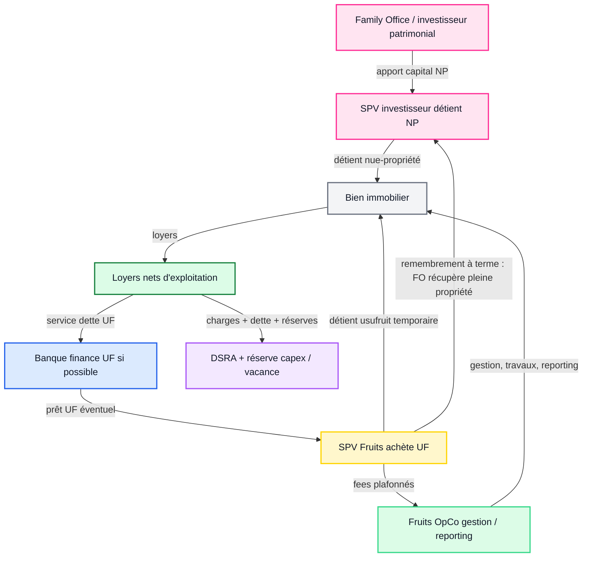
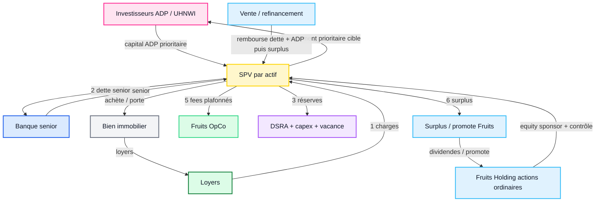
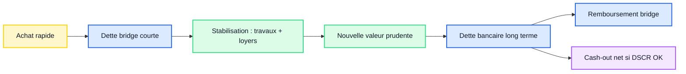
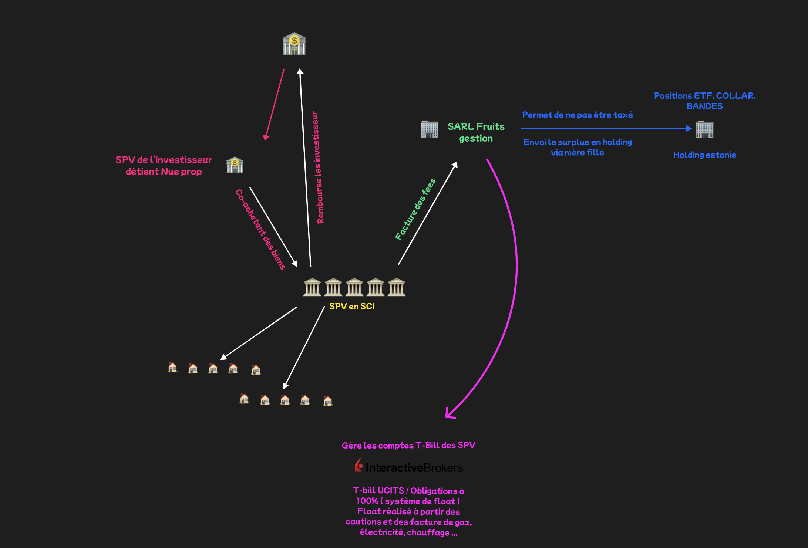
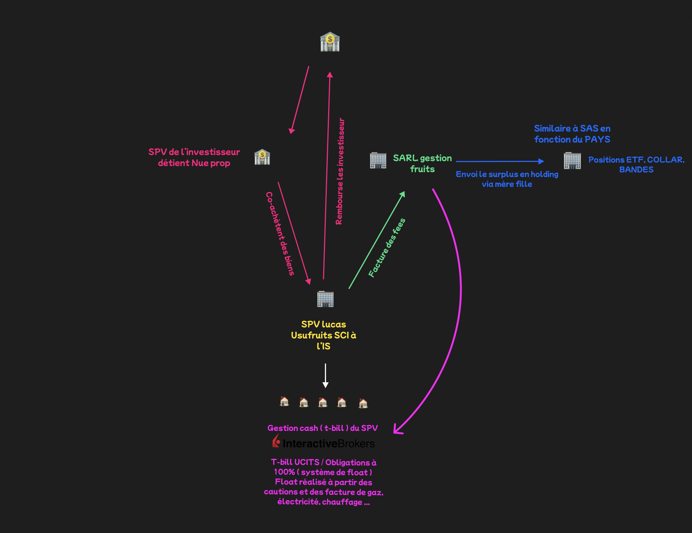

# SCHÉMAS DE STRUCTURE

## Code couleur standard Fruits

Ce code couleur doit être repris dans tous les schémas pour se repérer vite.

| Élément | Couleur | Code | Rôle |
| --- | --- | --- | --- |
| Investisseurs / FO / UHNWI | Rose | `#FF2D95` | Apport de capital, NP, ADP, prêt privé |
| Fruits / SPV opérateur | Jaune | `#FFD400` | Véhicule qui porte ou exploite l'actif |
| OpCo / gestion Fruits | Vert | `#36D88A` | Gestion, reporting, travaux, fees |
| Banque / dette senior | Bleu foncé | `#2563EB` | Dette bancaire, bridge, crédit senior |
| Holding / trésorerie / ETF | Bleu clair | `#38BDF8` | Holding, surplus, portefeuille financier |
| Réserves / DSRA / capex | Violet | `#A855F7` | Cash sécurisé, réserves, comptes dédiés |
| Actifs immobiliers | Gris | `#E5E7EB` | Biens, lots, portefeuille |
| Flux de cash / loyers | Vert foncé | `#15803D` | Cash entrant, loyers, exploitation |
| Flux de dette / remboursement | Bleu | `#1D4ED8` | Service de dette, refinancement |
| Flux investisseur / capital | Rose foncé | `#DB2777` | Apport, remboursement investisseur |

Règle de lecture :

```text
rose = argent investisseur
jaune = SPV Fruits
vert = opération / gestion
bleu = dette / banque
violet = réserves
gris = actif immobilier
```

## Schéma 1 - Usufruit / nue-propriété avec FO



## Schéma 2 - SPV avec actions de préférence



## Schéma 3 - Bridge-to-term / refinancement



## Images originales




